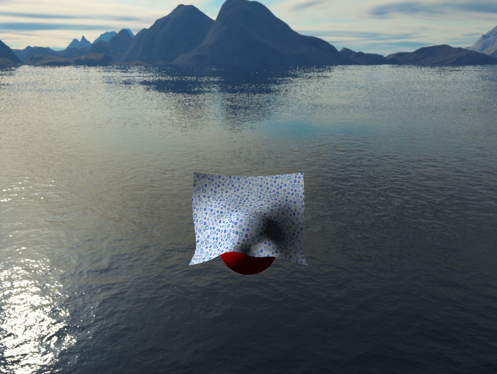

# ClothSimulation
An implicit Euler method for cloth simulation

# About this project
Realistic cloth simulation is important in many fileds such as film industry, computer game and VR shopping. In this project, an implicit Euler method is implemented to integrate the mass-spring system.

# Features
- Strain constraint
- Bending constraint
- Lighting
- Camera control
- Collision (simple)
- Drag by mouse

# Environment
- Visual Studio
- QT
- OpenGl (Glad)
- GLM (for math computation)
- Eigen (solve sparse linear equations)
